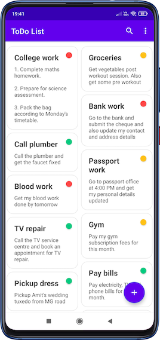
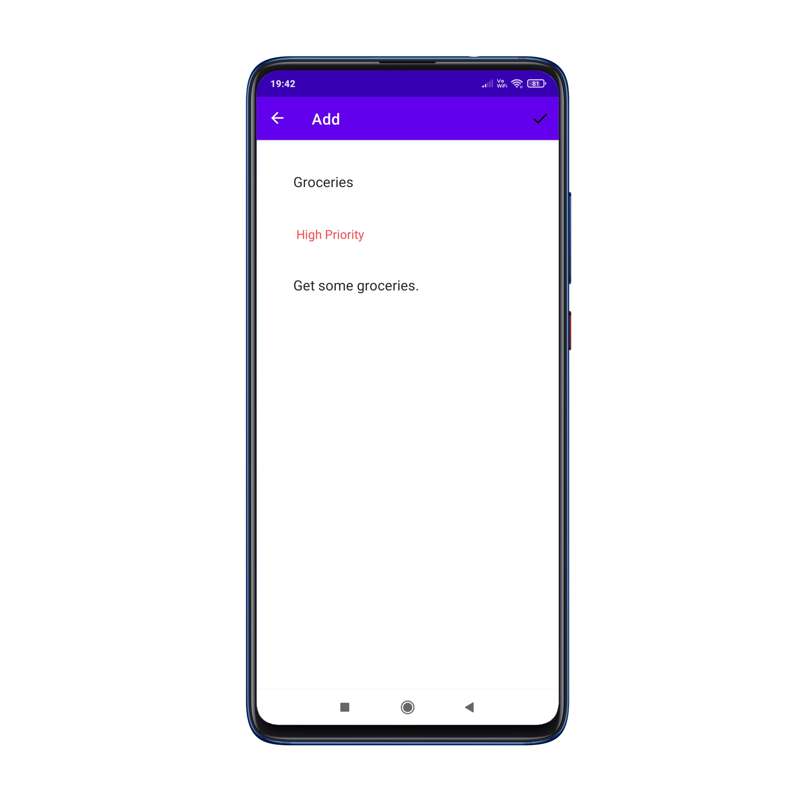
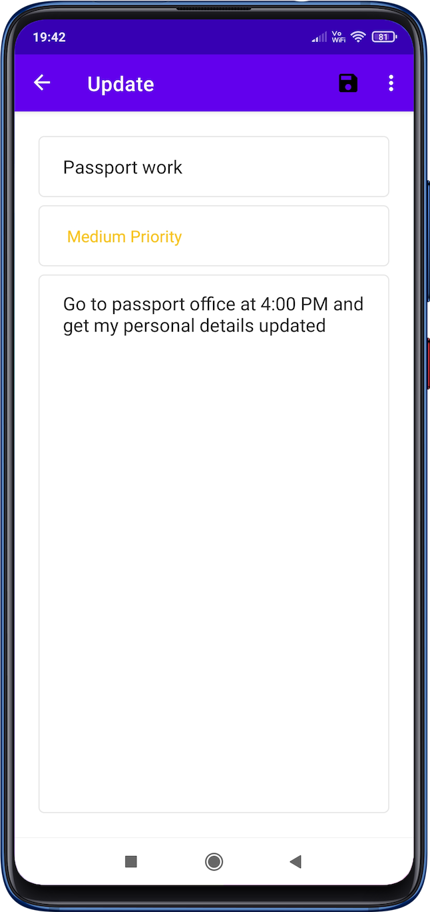
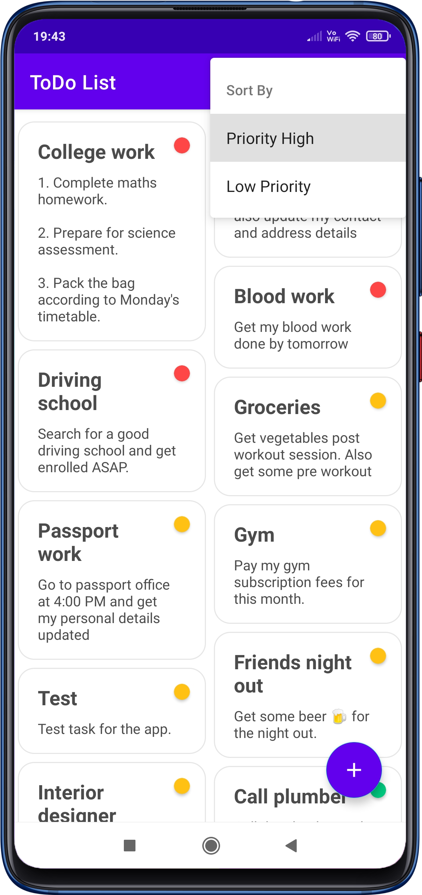

# ToDo App 

[Demo Here](https://1drv.ms/v/s!Al-3PxowK-xSiQMsDUG8lPys6SZz?e=5j9Kp1)

A ToDo list app created in kotlin. Used various android architecture components:

- Room
- Lifecycle
- ViewModel
- Data binding
- Navigation

## Features

- Add your daily tasks
- Update existing tasks
- Assign priority to tasks- HIGH, MEDIUM or LOW
- Swipe to delete tasks with undo functionality
- Sort all the tasks on the basis of priority
- Search functionality

## Screenshots

  
   
  
  
  

